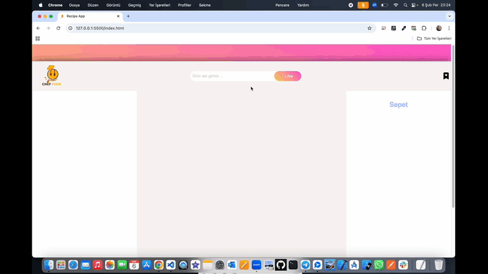

# Recipe-App 🍲

<li>Bu proje HTML,CSS,SCSS,JS,API ile oluşturulmuş Tarif Uygulaması site arayüzü içerir.</li>
<li>Proje de Apı desteği ile tarif arama ve her tarif için Uuıd yardımıyla benzersiz id değeri oluşturulmuştur.</li>
<li>Uygulama sayesinde beğenilen tarifleri favorileme,listeleme ayrıca sepete ekleme ve silme özellikleri mevcuttur.</li>
<li>Modern kullanıcı dostu duyarlı arayüze sahiptir.</li>

# Kullanılan Teknolojiler 🎨

<li>HTML</li>
<li>CSS</li>
<li>SCSS</li>
<li>JS</li>
<li>API</li>
<li>TOASTİFY</
<li>UUID</

# Ekran Görüntüsü 🎥
      

# İletişim 📩
yunusemreoral@hotmail.com.tr

